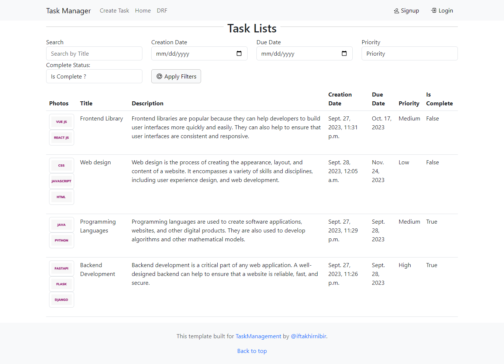

# Project Name: Task Manager
This application allows multiple users to create, view, update, and delete their tasks

## Ways to set up and run projects.
1. First, you need to install Python and pip on your local machine
2. Create a folder and open the terminal in that folder
3. Create a virtual environment using the terminal. For example, the environment name is "env"
```bash
python -m venv env 
```
4. Activate the environment
```bash
env\Scripts\activate
```
5. Now you need to clone the repository.
```bash
git clone https://github.com/IftakhirNibir/Django_Task_Manager.git 
```
6. Open the project folder
```bash
cd Django_Task_Manager
```
7. Install the required prerequisites using
```bash
pip install -r requirement.txt
```
8. Open "task_manager" folder
```bash
cd task_manager
```
9. Create ".env" file inside the current folder
10. Now copy the below section and paste it into your ".env" file to set up the environment variables and make the necessary changes
```bash
DB_ENGINE=django.db.backends.postgresql
DB_NAME=<Your-DB-Name>
DB_USER=<Your-DB-UserName>
DB_PASSWORD=<Your-DB-Password>
DB_HOST=<Your-DB-Host>
DB_PORT=<Your-DB-PortNumber>
```
11. Now run the server
```bash
py manage.py runserver
```
12. Open the browser and go 
```bash
http://127.0.0.1:8000/
```
Now you need to sign up and log in to get our service
13. You can also visit our admin panel. For this, you need to create superuser in terminal
```bash
py manage.py createsuperuser
```
## API Endpoints

This section provides an overview of the available API endpoints, their URLs, and their intended use. 

## Base URL

The base URL for all API endpoints is: `http://127.0.0.1:8000/api/`

 1. Endpoint 1: List of Tasks

- **URL**: `http://127.0.0.1:8000/api/tasks/`
- **Method**: GET
- **Description**: Fetch a list of all tasks.
- **Authentication**: Not required.
- **Body**: JSON data containing a list of tasks.

2. Endpoint 2: Create a New Task

- **URL**: `http://127.0.0.1:8000/api/tasks/`
- **Method**: POST
- **Description**: Fetch a list of all tasks.
- **Authentication**: Not required.
- **Body**: JSON data containing a list of tasks.

3. Endpoint 3: Update a Task

- **URL**: `http://127.0.0.1:8000/api/tasks/<id>`
- **Method**: PUT
- **Description**: Fetch all information of a task.
- **Authentication**: Not required.
- **Body**: JSON data containing a piece of task information.

4. Endpoint 4: Delete a Task

- **URL**: `http://127.0.0.1:8000/api/tasks/<id>`
- **Method**: DELETE
- **Description**: Fetch all information of a task.
- **Authentication**: Not required.
- **Body**: JSON data containing a piece of task information.

## The UI of the website is given below

